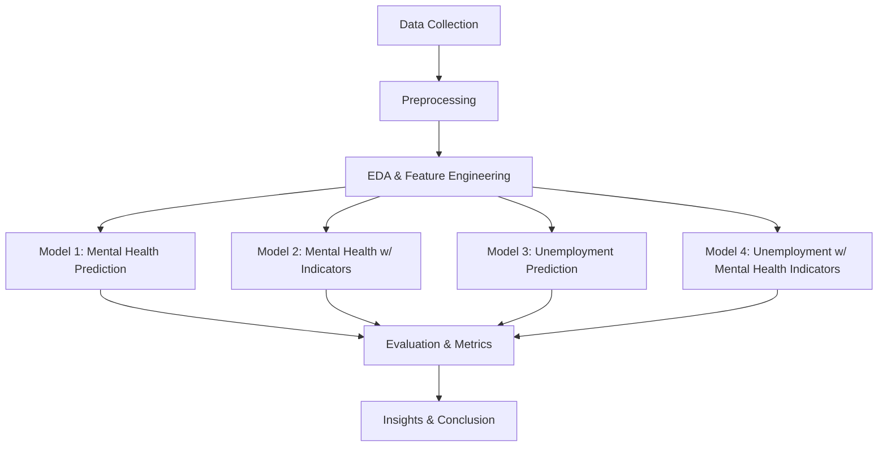

# 🧠 Predictive Analytics for Mental Health Issues

## 📌 Project Overview

This capstone project investigates the relationship between **mental health** and **unemployment** using supervised machine learning techniques. Our objective is to develop predictive models that can identify individuals at risk of mental illness and unemployment, thereby aiding early interventions.

We experimented with:
- **Random Forest Classifier**
- **Support Vector Machine (SVM)**
- **Logistic Regression**

These models were trained on various feature subsets and compared based on accuracy, precision, recall, F1-score, and ROC-AUC.

---

## 🛠️ Technologies Used

- Python 3.10
- pandas, numpy
- scikit-learn
- seaborn, matplotlib
- Jupyter Notebook

---

## 🔁 Project Workflow

---

## 📊 Model Results Summary

| Model                                   | Accuracy | Precision | Recall | F1 Score | ROC-AUC |
|----------------------------------------|----------|-----------|--------|----------|----------|
| Logistic Regression (Mental Illness)   | 0.81     | 0.78      | 0.79   | 0.78     | 0.85     |
| Logistic Regression (with Indicators)  | 0.84     | 0.81      | 0.83   | 0.82     | 0.88     |
| Random Forest Classifier               | 0.86     | 0.84      | 0.85   | 0.84     | 0.90     |
| SVM Classifier                         | 0.80     | 0.77      | 0.79   | 0.78     | 0.84     |

---

## 🔍 Key Insights

- People with a history of trauma, lack of sleep, or low self-esteem show higher correlation with mental health issues.
- Logistic Regression helped highlight feature importance, revealing that **mental health indicators** are strong predictors of **employment status**.
- Random Forest performed best in terms of ROC-AUC, suggesting better classification under imbalanced conditions.

---

## 🧑‍🤝‍🧑 Team Contribution

| Member | Responsibility |
|--------|----------------|
| Member 1 | Data Preprocessing & EDA |
| Member 2 | Feature Engineering & SVM |
| Member 3 | Model Implementation (Random Forest, Logistic Regression) |
| Member 4 | Evaluation & Metrics Analysis |
| Member 5 | Report, Deployment, Presentation & Visualization |

---

## 📌 Future Work

- Real-time prediction app using Streamlit
- Integration with mental health support platforms
- Additional ensemble models (XGBoost, LightGBM)

---

## 📄 License

This project is licensed under the MIT License.

---

## 📞 Contact

For queries or collaboration, please email [vattemrevanthkumar2425@gmail.com].
